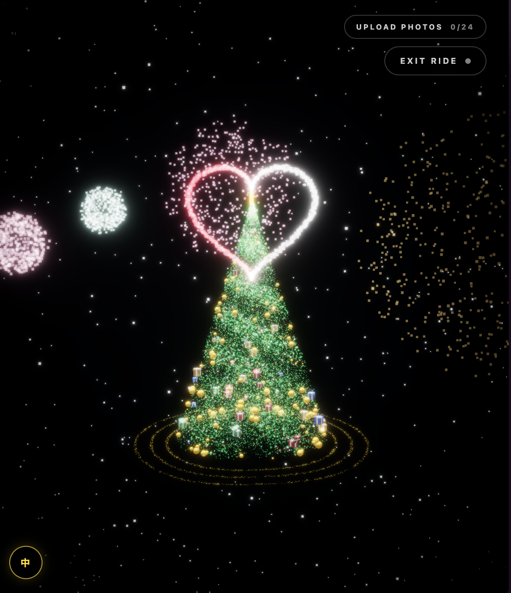

🎄✨ **Merry Christmas & Happy New Year** ✨🎄  
圣诞快乐，新年快乐！🎁🎆

这个项目是我为圣诞节制作的一棵互动圣诞树。  
我希望用一种温柔、有仪式感的方式，把 **祝福、回忆、愿望和陪伴** 聚集在一起。

愿你可以和爱的人一起浏览这棵树，  
上传属于你们的照片，许下新的愿望，  
在这个冬天感受到幸福与温暖，  
迎接一个充满希望的新一年。❤️

---

🎄✨ **Merry Christmas & Happy New Year** ✨🎄

This project is a small Christmas gift —  
an interactive Christmas tree created to hold **memories, wishes, and warmth**.

I hope you can enjoy this experience together with the people you love:  
upload photos, explore slowly, make a wish,  
and welcome the New Year with happiness and hope. ✨

---

# 🎄 Interactive Christmas Tree

<p align="center">
  
  
</p>

An interactive, cinematic 3D Christmas Tree experience built with  
**React**, **TypeScript**, and **Three.js (React Three Fiber)**.

This project turns a Christmas tree into a **digital wishing tree**, where users can explore, upload photos, interact through gestures, and make wishes.

👉 Live Demo: https://interactive-christmas-tree.netlify.app

---

## ✨ Idea

Instead of a static Christmas tree, this project creates an **immersive holiday ritual**:

- The tree forms itself from floating particles
- Personal photos appear as Polaroid-style ornaments
- Users can freely explore the tree in first-person
- Wishes can be written and optionally shared anonymously

The experience is designed to feel **warm, magical, and personal**.

---

## 🌲 Main Features

### Tree Morphing

- Dual-position particle system (scattered → tree shape)
- Smooth interpolation-based transitions
- Implemented with `THREE.Points` and custom shaders

### Gesture Control

- Camera-based hand gesture detection
- Open / closed hand gestures trigger interactions
- Smoothed and debounced to prevent accidental activation

### Photo Upload

- Upload photos directly in the browser
- Photos appear as Polaroid-style cards on the tree
- No server upload — images stay in the user’s browser

**For self-deployment:**

- Place images in `public/static/photos/`
- Register image filenames in `src/constants.ts`

### Ride Mode (First-Person View)

- A golden particle ribbon spirals around the tree
- Camera moves upward along the path
- Free mouse / touch look-around for close photo viewing

### Wish System

- Write short wishes (≤200 characters)
- Anonymous by default
- Wishes are stored securely via **Netlify Functions → Neon Postgres**
- Frontend never accesses the database directly

---

## 🛠 Tech Stack

- React + TypeScript
- Three.js / React Three Fiber
- Tailwind CSS
- MediaPipe (gesture recognition)
- Neon (PostgreSQL)
- Netlify (deployment & serverless functions)

---

## 🚀 Local Development

```bash
npm install
npm run dev
```

## ☁️ Cloud Deployment (Netlify + Neon)

This project uses **Netlify serverless functions** to store wishes in a **Neon Postgres database**.  
Database credentials are kept **server-side only**.

### 1) Deploy on Netlify

1. Push the project to GitHub
2. Create a new site on **Netlify** and connect the repository
3. Build settings (Vite default):
   - Build command: `npm run build`
   - Publish directory: `dist`

---

### 2) Create & Connect a Neon Database

1. In Netlify, click **“Add database” / “Connect database”**
2. Choose **Neon** and follow the guided setup
3. Netlify will automatically:
   - Create the Neon Postgres database
   - Bind the database to your site
   - Inject the connection string as an environment variable

No manual database URL configuration is required.

---

### 3) Initialize the Database

Run the provided SQL in the Neon console to create the `wishes` table and indexes.

After deployment, submitted wishes will be securely stored in Neon.

---

### 4) Access the Database in Netlify Functions

Database access is handled **server-side only** using Netlify Functions.

Example:

```ts
import { neon } from "@netlify/neon";

const sql = neon(); // automatically uses env NETLIFY_DATABASE_URL

const [post] = await sql`
  SELECT * FROM posts WHERE id = ${postId}
`;
```

---

## 🔒 Privacy

- No authentication
- No personal data collected
- Uploaded photos stay in the browser
- Wishes are anonymous and optional to share

---

## 📜 License

MIT License

```
MIT License

Copyright (c) 2025 Harry Xu

Permission is hereby granted, free of charge, to any person obtaining a copy
of this software and associated documentation files (the "Software"), to deal
in the Software without restriction, including without limitation the rights
to use, copy, modify, merge, publish, distribute, sublicense, and/or sell
copies of the Software, and to permit persons to whom the Software is
furnished to do so, subject to the following conditions:

The above copyright notice and this permission notice shall be included in all
copies or substantial portions of the Software.

THE SOFTWARE IS PROVIDED "AS IS", WITHOUT WARRANTY OF ANY KIND, EXPRESS OR
IMPLIED, INCLUDING BUT NOT LIMITED TO THE WARRANTIES OF MERCHANTABILITY,
FITNESS FOR A PARTICULAR PURPOSE AND NONINFRINGEMENT. IN NO EVENT SHALL THE
AUTHORS OR COPYRIGHT HOLDERS BE LIABLE FOR ANY CLAIM, DAMAGES OR OTHER
LIABILITY, WHETHER IN AN ACTION OF CONTRACT, TORT OR OTHERWISE, ARISING FROM,
OUT OF OR IN CONNECTION WITH THE SOFTWARE OR THE USE OR OTHER DEALINGS IN THE
SOFTWARE.
```
